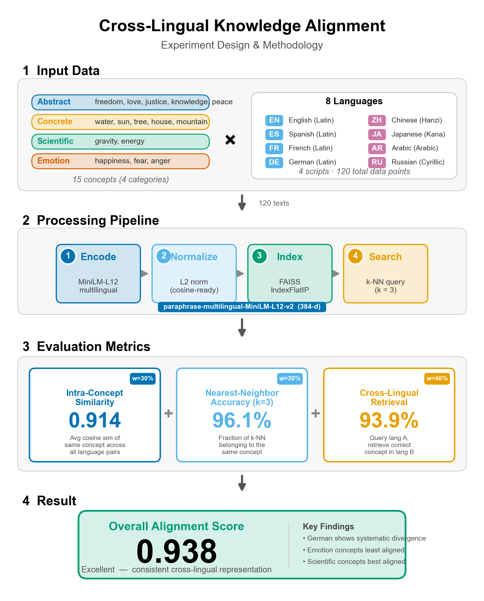
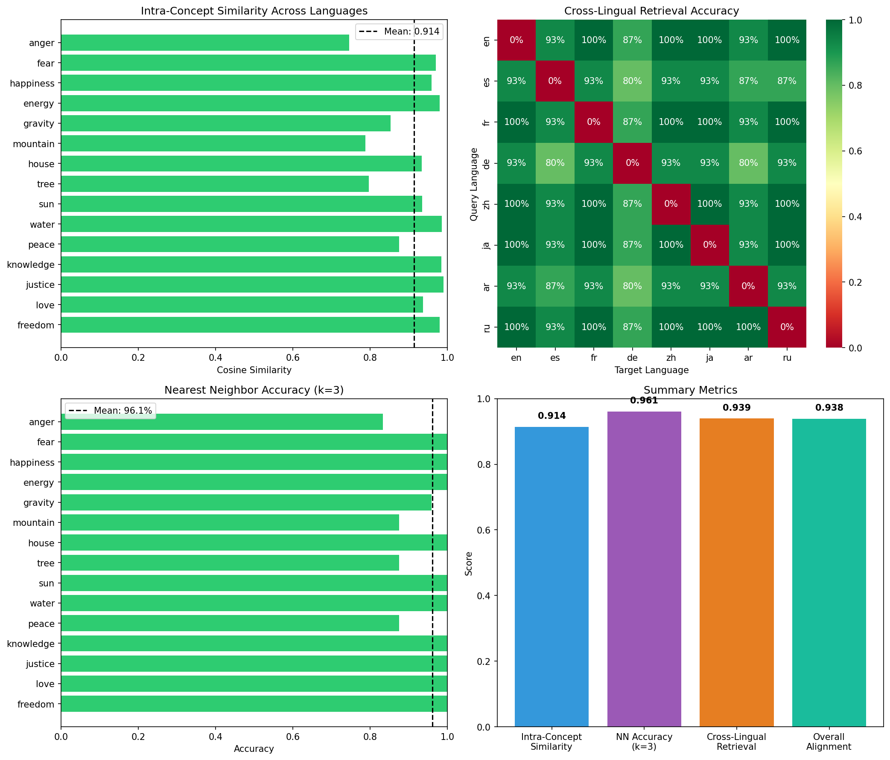
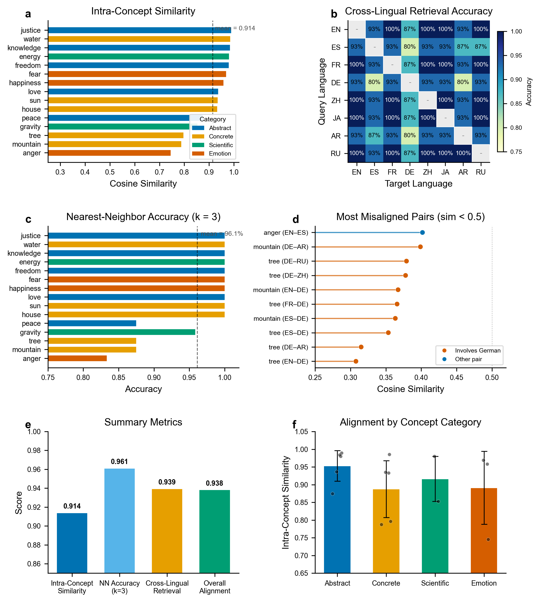

# Cross-Lingual Knowledge Alignment Analysis

**Research Question:** How consistently is the same concept represented across different languages in a multilingual embedding model?

## Motivation

Multilingual language models are trained to map text from different languages into a shared embedding space. In theory, semantically equivalent concepts should have similar vector representations regardless of the source language. This property—called **cross-lingual alignment**—is crucial for:

- **Cross-lingual information retrieval**: Finding documents in one language using queries in another
- **Zero-shot cross-lingual transfer**: Training a model on English data and deploying it on other languages
- **Multilingual semantic search**: Building search systems that work across language barriers
- **Machine translation quality**: Better alignment correlates with better translation

However, the degree to which this alignment actually holds in practice varies by:
- Concept type (concrete vs. abstract)
- Language family similarity
- Training data distribution
- Model architecture

This experiment quantifies cross-lingual alignment using FAISS for efficient similarity search across 15 concepts in 8 languages.

## Experimental Setup

### Model
- **Model**: `sentence-transformers/paraphrase-multilingual-MiniLM-L12-v2`
- **Embedding dimension**: 384
- **Languages supported**: 50+ languages

### Languages Tested
| Code | Language | Script |
|------|----------|--------|
| en | English | Latin |
| es | Spanish | Latin |
| fr | French | Latin |
| de | German | Latin |
| zh | Chinese | Hanzi |
| ja | Japanese | Kanji/Kana |
| ar | Arabic | Arabic |
| ru | Russian | Cyrillic |

### Concepts (15 total)

**Abstract concepts**: freedom, love, justice, knowledge, peace

**Concrete concepts**: water, sun, tree, house, mountain

**Scientific concepts**: gravity, energy

**Emotion concepts**: happiness, fear, anger

### Methodology

1. **Embedding Generation**: Generate embeddings for each concept in each language (120 total vectors)
2. **Normalization**: L2-normalize vectors for cosine similarity via inner product
3. **FAISS Indexing**: Build `IndexFlatIP` index for efficient similarity search
4. **Metrics Computation**:
   - **Intra-concept similarity**: Average pairwise cosine similarity between translations of the same concept
   - **Nearest neighbor accuracy**: Percentage of k-nearest neighbors that are the same concept
   - **Cross-lingual retrieval**: Accuracy of retrieving the correct concept when querying across languages



### Tools
- **FAISS**: Facebook AI Similarity Search for efficient vector operations
- **Sentence-Transformers**: Multilingual embedding generation
- **NumPy**: Numerical computations
- **Matplotlib/Seaborn**: Visualization

## Results

### Overall Alignment Score: **0.938** (Excellent)

The model demonstrates strong cross-lingual alignment, with concepts clustering by meaning rather than by language.

### Metric Breakdown

| Metric | Score | Description |
|--------|-------|-------------|
| Intra-Concept Similarity | 0.914 | Avg cosine similarity within same concept across languages |
| Nearest Neighbor Accuracy (k=3) | 96.1% | % of nearest neighbors that are the same concept |
| Cross-Lingual Retrieval | 93.9% | Accuracy retrieving correct concept across language pairs |

### Cross-Concept Dissimilarity Baseline

To contextualize the intra-concept similarity scores above, we measured the similarity between words from **different** concepts. This establishes a baseline for what "unrelated" looks like in this embedding space.

| Scenario | Avg Similarity | Avg Dissimilarity |
|----------|---------------|-------------------|
| Same concept, different language (e.g. "water" vs "Wasser") | **0.919** | 0.081 |
| Different concept, same language (e.g. "freedom" vs "water") | 0.252 | **0.748** |
| Different concept, different language (e.g. "freedom" vs "agua") | 0.289 | **0.711** |

**Selected cross-concept pairs (English):**

```
freedom      vs water       : sim=0.347  dissim=0.653
love         vs mountain    : sim=0.291  dissim=0.709
justice      vs sun         : sim=0.188  dissim=0.812
happiness    vs tree        : sim=0.193  dissim=0.807
fear         vs house       : sim=0.246  dissim=0.754
knowledge    vs gravity     : sim=0.284  dissim=0.716
```

The **discriminability gap** between same-concept pairs (0.919) and cross-concept pairs (0.252) is **0.667**, confirming that the model strongly separates different concepts while keeping translations of the same concept tightly clustered.

### Intra-Concept Similarity by Concept

```
Concept          Similarity    Quality
─────────────────────────────────────────
justice          0.9894        Excellent
water            0.9856        Excellent
knowledge        0.9840        Excellent
energy           0.9800        Excellent
freedom          0.9798        Excellent
fear             0.9692        Excellent
happiness        0.9582        Excellent
love             0.9365        Excellent
sun              0.9349        Excellent
house            0.9330        Excellent
peace            0.8749        Good
gravity          0.8528        Good
tree             0.7966        Moderate
mountain         0.7875        Moderate
anger            0.7456        Moderate
─────────────────────────────────────────
Average          0.9139
```

### Cross-Lingual Retrieval Matrix

Query in row language, retrieve from column language:

|    | en | es | fr | de | zh | ja | ar | ru |
|----|----|----|----|----|----|----|----|----|
| en | - | 93% | 100% | 87% | 100% | 100% | 93% | 100% |
| es | 93% | - | 93% | 80% | 93% | 93% | 87% | 87% |
| fr | 100% | 93% | - | 87% | 100% | 100% | 93% | 100% |
| de | 93% | 80% | 93% | - | 93% | 93% | 80% | 93% |
| zh | 100% | 93% | 100% | 87% | - | 100% | 93% | 100% |
| ja | 100% | 93% | 100% | 87% | 100% | - | 93% | 100% |
| ar | 93% | 87% | 93% | 80% | 93% | 93% | - | 93% |
| ru | 100% | 93% | 100% | 87% | 100% | 100% | 100% | - |

### Language Centroid Distances

Distances between language centroids (lower = more overlap in embedding space):

**Closest pairs** (best aligned):
- French ↔ Russian: 0.004
- Chinese ↔ Japanese: 0.006
- Chinese ↔ Arabic: 0.011
- English ↔ French: 0.012

**Most distant pairs**:
- English ↔ Japanese: 0.045
- German ↔ Japanese: 0.036
- German ↔ Chinese: 0.034

### Misaligned Concept Pairs

Pairs with similarity < 0.5 (indicating poor alignment):

| Concept | Language Pair | Similarity |
|---------|---------------|------------|
| tree | English ↔ German | 0.308 |
| tree | German ↔ Arabic | 0.315 |
| tree | Spanish ↔ German | 0.353 |
| mountain | Spanish ↔ German | 0.363 |
| tree | French ↔ German | 0.366 |
| mountain | English ↔ German | 0.367 |
| tree | German ↔ Chinese | 0.378 |
| tree | German ↔ Russian | 0.379 |
| mountain | German ↔ Arabic | 0.399 |
| anger | English ↔ Spanish | 0.402 |

## Findings

### 1. Concept Type Matters

**Best aligned (>0.95 similarity)**:
- Scientific/universal concepts: water, energy, gravity
- Legal/institutional concepts: justice, knowledge
- Basic emotions: fear

**Worst aligned (<0.85 similarity)**:
- Nature concepts with cultural variation: tree, mountain
- Complex emotions: anger, peace

**Interpretation**: Concepts with universal, unambiguous meanings align better than concepts that may have cultural or contextual variations.

### 2. German Embeddings Show Systematic Divergence

German consistently shows lower retrieval accuracy (80-93%) compared to other languages. The misaligned pairs are predominantly German-X pairs:
- 8 of 10 worst-aligned pairs involve German
- German centroid is furthest from other language centroids

**Possible causes**:
- German compound words ("Baum" vs "tree") may capture different semantic features
- Training data distribution differences
- Morphological complexity affecting tokenization

### 3. Script Similarity ≠ Embedding Similarity

Surprisingly, languages with different scripts show strong alignment:
- Chinese ↔ Japanese: 0.006 distance (excellent)
- Chinese ↔ Arabic: 0.011 distance (excellent)
- French ↔ Russian: 0.004 distance (best overall)

This suggests the model learns semantic representations that transcend surface-level orthographic differences.

### 4. High-Resource Language Pairs Perform Best

The best-performing language pairs for retrieval:
- English ↔ French: 100%
- English ↔ Chinese: 100%
- English ↔ Japanese: 100%
- French ↔ Chinese: 100%
- French ↔ Japanese: 100%

These are all high-resource languages with abundant parallel training data.

### 5. Strong Discriminability Between Concepts

Cross-concept word pairs (e.g. "justice" vs "sun") average only 0.252 similarity, compared to 0.919 for same-concept cross-lingual pairs. This 0.667 gap demonstrates that the model clusters by **meaning** rather than by language or surface form. Even across different languages and scripts, unrelated concepts remain well-separated (avg 0.289 similarity), ruling out the possibility that high intra-concept similarity is merely an artifact of general embedding proximity.

### 6. Emotion Concepts Show Cultural Variation

"Anger" shows the lowest intra-concept similarity (0.746) and appears in the misaligned pairs list. This aligns with linguistic research showing that emotion concepts vary significantly across cultures and may not have exact translations.

## Visualization



The visualization shows:
1. **Top-left**: Intra-concept similarity across languages (most concepts >0.85)
2. **Top-right**: Cross-lingual retrieval heatmap (German column shows lower values)
3. **Bottom-left**: Nearest neighbor accuracy by concept
4. **Bottom-right**: Summary metrics showing overall excellent alignment



The detailed analysis figure shows:
- **(a)** Intra-concept similarity color-coded by category (Abstract, Concrete, Scientific, Emotion)
- **(b)** Cross-lingual retrieval accuracy heatmap across all language pairs
- **(c)** Nearest-neighbor accuracy (k=3) with 96.1% mean
- **(d)** Most misaligned pairs (sim < 0.5), highlighting German's systematic divergence
- **(e)** Summary metrics bar chart
- **(f)** Alignment by concept category showing Abstract and Scientific concepts outperforming Emotion concepts

## Implications

### For Practitioners
- Multilingual search/retrieval systems using this model will work well for most concept types
- Exercise caution with German queries—consider query expansion or ensemble approaches
- Abstract and scientific concepts are safer for cross-lingual transfer than culturally-loaded terms

### For Researchers
- The "German divergence" phenomenon warrants further investigation
- Emotion concept alignment could be a useful probe for cultural bias in models
- Alignment quality varies by concept type—evaluation should cover diverse semantic categories

## Reproducing This Experiment

```bash
# Clone and setup
cd faiss-demo
python3 -m venv venv
source venv/bin/activate
pip install -r requirements.txt

# Run experiment
python cross_lingual_alignment.py
```

### Extending the Experiment

```python
from cross_lingual_alignment import CrossLingualAlignmentExperiment

# Test different models
experiment = CrossLingualAlignmentExperiment(
    model_name="sentence-transformers/LaBSE"  # Google's model
)
results = experiment.run_full_analysis()

# Compare multiple models
models = [
    "sentence-transformers/paraphrase-multilingual-MiniLM-L12-v2",
    "sentence-transformers/paraphrase-multilingual-mpnet-base-v2",
    "sentence-transformers/LaBSE"
]
scores = experiment.compare_models(models)
```

## Files

| File | Description |
|------|-------------|
| `cross_lingual_alignment.py` | Main experiment code |
| `fig/experiment_diagram.png` | Experiment design & methodology diagram |
| `fig/alignment_analysis.png` | Results visualization (4-panel) |
| `fig/cross_lingual_alignment_figure.png` | Detailed analysis (6-panel) |
| `alignment_results.json` | Raw results in JSON format |
| `requirements.txt` | Python dependencies |

## References

- [FAISS: A Library for Efficient Similarity Search](https://github.com/facebookresearch/faiss)
- [Sentence-Transformers: Multilingual Sentence Embeddings](https://www.sbert.net/)
- [Multilingual MiniLM Paper](https://arxiv.org/abs/2002.10957)
- [On the Cross-lingual Transferability of Monolingual Representations](https://arxiv.org/abs/1910.11856)

## License

MIT
